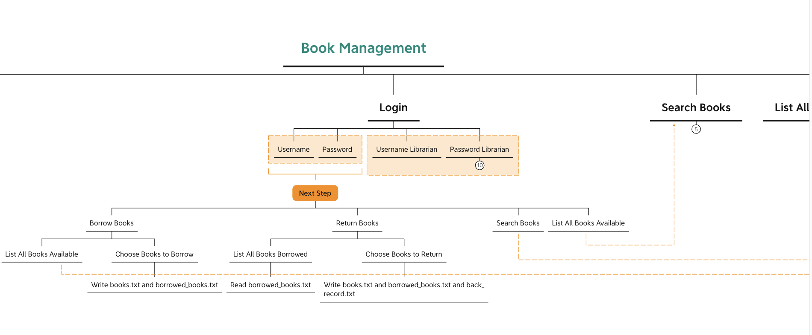
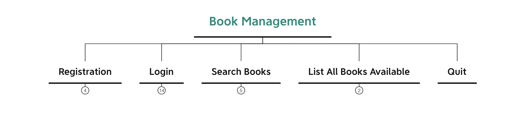
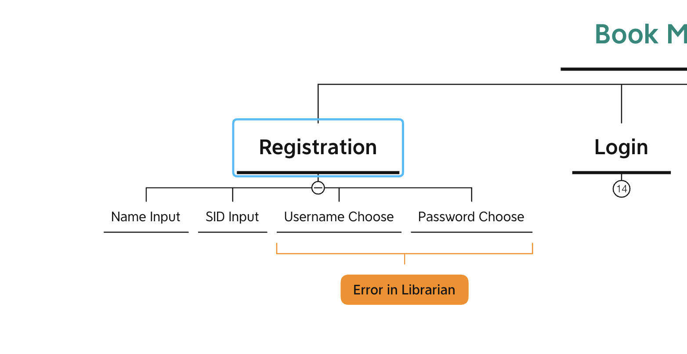
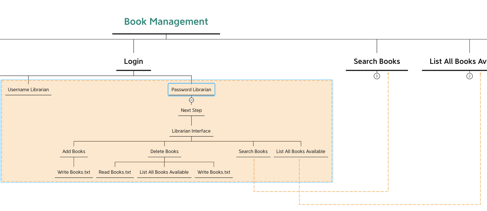
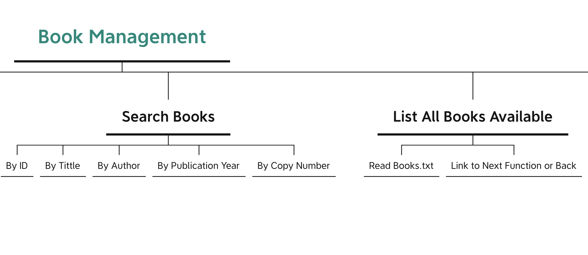

Update 2022.3.10
The first step was to learn about chaining tables and then initially design the functions for adding, deleting, searching and listing books used by administrators. Simple listing of all functions in the same user interface (not the final version, only for upgrading and testing).

Update 2022.3.16
Complete the writing of the book borrowing and returning module under user
Preliminary writing of adding and deleting books under library
Change the prototype of the Secretary

Update 2022.3.21
Complete the module of addition and subtraction book
Add the tour part without login
Complete book borrowing and returning without login

Update 2022.3.22
Using the makefile integration function initially, there is a core spitting error
Fix the bug, but not completely

Update 2022.3.23
Basic completion of main function
Build a fully functional architecture
Small scale function upgrade iteration

Update 2022.3.24
Complete the writing of all functions
Fix the bug that the borrowed and returned books cannot be saved in TXT

Update 2022.3.27
The test found that the book could not be returned after borrowing

Update 2022.4.6
Testing and packaging